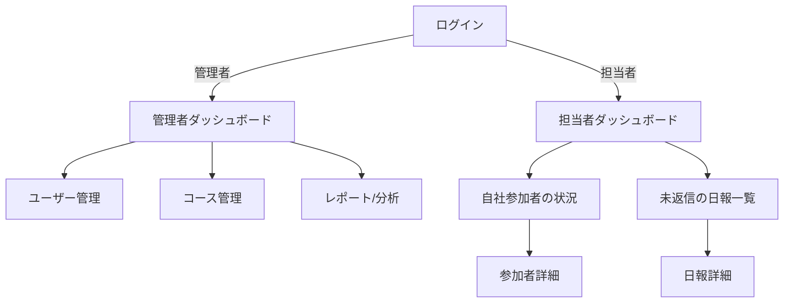

# 学習管理システム（LMS）画面設計書

## 1. 共通仕様

### 1.1 ヘッダー
- ロゴ（左上配置）
- グローバルナビゲーション
  - ホーム
  - 研修コース
  - 日報
  - 教材ライブラリ
  - マイページ
- 通知アイコン（右上）
- ユーザーメニュー（右上）
  - プロフィール設定
  - ログアウト

### 1.2 フッター
- 会社情報
- 利用規約
- プライバシーポリシー
- お問い合わせ
- 著作権表示

### 1.3 レスポンシブ対応
- ブレイクポイント
  - スマートフォン: 〜767px
  - タブレット: 768px〜1023px
  - PC: 1024px〜

## 2. 画面一覧

### 2.1 認証系画面
1. ログイン画面
   - 画面概要
     - ユーザー認証を行うための初期画面
     - 管理者/担当者ロールによる画面遷移の分岐
   - 画面レイアウト
     ```
     +------------------------+
     |        ヘッダー         |
     +------------------------+
     | ログインフォーム        |
     |  - メールアドレス入力   |
     |  - パスワード入力       |
     +------------------------+
     | ログインボタン         |
     |  - 管理者ログイン       |
     |  - 担当者ログイン       |
     +------------------------+
     |        フッター         |
     +------------------------+
     ```
   - 機能要件
     - 簡易ログイン機能（仮実装）
     - ロールによる画面遷移の分岐
     - 入力バリデーション
     - エラーメッセージ表示

2. パスワードリセット画面
3. 初回パスワード設定画面

### 2.2 ホーム系画面
1. ダッシュボード
2. 担当者ダッシュボード
   - 画面概要
     - 担当者ロールのユーザーが利用するホーム画面
     - 自社参加者の状況や日報返信へのリンクを表示
   - 画面レイアウト
     ```
     +------------------------+
     |        ヘッダー         |
     +------------------------+
     | 自社参加者の状況      |
     +------------------------+
     | 未返信の日報一覧      |
     +------------------------+
     |        フッター         |
     +------------------------+
     ```
   - 表示項目
     - 自社参加者の状況
       - 参加者名
       - 所属
       - 進捗状況
     - 未返信の日報一覧
       - 報告者名
       - 報告日
       - 内容（一部）
       - 返信リンク
   - 機能要件
     - 各項目の詳細ページへの遷移
     - 日報への返信機能
3. お知らせ一覧
4. 通知設定

### 2.3 日報系画面
1. 日報一覧
2. 日報作成/編集
3. 日報詳細
4. コメント管理

### 2.4 研修系画面
1. コース一覧
2. コース詳細
3. 教材ビューア
4. テスト受験
5. アンケート回答
6. 進捗確認

### 2.5 管理系画面
1. ユーザー管理
2. コース管理
3. 教材管理
4. レポート/分析

## 3. 主要画面詳細設計

### 3.1 ダッシュボード画面
#### 画面概要
ユーザーのホーム画面として、重要な情報を一覧表示する。

#### 画面レイアウト
```
+------------------------+
|        ヘッダー         |
+------------------------+
| 進行中の     | お知らせ  |
| コース       |          |
+-------------+----------+
| 本日の       | 未完了の  |
| タスク       | 課題     |
+-------------+----------+
| 最近の活動履歴         |
+------------------------+
|        フッター         |
+------------------------+
```

#### 表示項目
1. 進行中のコース
   - コース名
   - 進捗率
   - 残り日数
   - ステータス

2. お知らせ
   - タイトル
   - 日付
   - 重要度
   - 既読/未読

3. 本日のタスク
   - タスク名
   - 締切時間
   - 優先度

4. 活動履歴
   - 活動種類
   - 日時
   - 詳細リンク

#### 機能要件
- 各セクションの折りたたみ/展開
- お知らせの既読/未読切り替え
- タスクの完了チェック
- 活動履歴のフィルタリング

### 3.2 日報作成/編集画面
#### 画面概要
日次の業務報告と体調管理を記録する画面。

#### 画面レイアウト
```
+------------------------+
|        ヘッダー         |
+------------------------+
| 日付選択               |
+------------------------+
| 気分/体調入力          |
| ニコニコカレンダー      |
+------------------------+
| 業務報告入力          |
| (リッチテキストエディタ) |
+------------------------+
| 公開範囲設定          |
+------------------------+
| 保存/キャンセルボタン   |
+------------------------+
|        フッター         |
+------------------------+
```

#### 入力項目
1. 基本情報
   - 日付（必須）
   - 気分（5段階、必須）
   - 体調（テキスト）

2. 業務報告
   - 本文（必須）
   - 添付ファイル
   - タグ

3. 公開設定
   - 公開範囲（全体/グループ/非公開）
   - 共有先ユーザー選択

#### 機能要件
- 自動保存
- プレビュー表示
- 下書き保存
- ファイルドラッグ&ドロップ

### 3.3 コース詳細画面
#### 画面概要
個別の研修コースの詳細情報と進捗を表示する画面。

#### 画面レイアウト
```
+------------------------+
|        ヘッダー         |
+------------------------+
| コース概要             |
+------------------------+
| 進捗状況              |
+------------------------+
| カリキュラム           |
|  - 教材一覧           |
|  - テスト             |
|  - アンケート          |
+------------------------+
| 学習履歴              |
+------------------------+
|        フッター         |
+------------------------+
```

#### 表示項目
1. コース概要
   - コース名
   - 説明
   - 期間
   - 担当講師

2. 進捗状況
   - 全体の進捗率
   - 残り日数
   - 次のタスク

3. カリキュラム
   - 教材リスト
   - 学習ステータス
   - 完了チェック

4. 学習履歴
   - 学習日時
   - 教材名
   - 学習時間

#### 機能要件
- 教材の閲覧
- テストの受験
- アンケートの回答
- 進捗の自動更新

### 3.4 教材ビューア画面
#### 画面概要
各種教材を閲覧するための専用ビューア画面。

#### 画面レイアウト
```
+------------------------+
|        ヘッダー         |
+------------------------+
| 教材タイトル           |
+------------------------+
| 目次    | コンテンツ    |
|        |              |
|        |              |
|        |              |
+--------+--------------+
| 操作パネル            |
+------------------------+
|        フッター         |
+------------------------+
```

#### 表示項目
1. 教材情報
   - タイトル
   - 種類
   - バージョン
   - ページ番号

2. コントロール
   - 再生/一時停止
   - シーク
   - 音量
   - 画質設定

3. 進捗情報
   - 閲覧状況
   - 経過時間
   - 残り時間

#### 機能要件
- 動画再生制御
- PDFページめくり
- ブックマーク
- メモ機能
- 進捗の自動保存

### 3.5 担当者ダッシュボード画面
#### 画面概要
担当者ロールのユーザーが利用するホーム画面として、自社参加者の状況や日報返信へのリンクを表示する。

#### 画面レイアウト
```
+------------------------+
|        ヘッダー         |
+------------------------+
| 自社参加者の状況      |
+------------------------+
| 未返信の日報一覧      |
+------------------------+
|        フッター         |
+------------------------+
```

#### 表示項目
1. 自社参加者の状況
   - 参加者名
   - 所属
   - 進捗状況
   - 詳細リンク

2. 未返信の日報一覧
   - 報告者名
   - 報告日
   - 内容（一部）
   - 返信リンク

#### 機能要件
- 各項目の詳細ページへの遷移
- 日報への返信機能

## 4. 画面遷移図



## 5. 共通部品設計

### 5.1 ボタン
- プライマリーボタン
  - 背景色: #007bff
  - テキスト色: #ffffff
  - ホバー時の明度変更: -10%

- セカンダリーボタン
  - 背景色: #6c757d
  - テキスト色: #ffffff
  - ホバー時の明度変更: -10%

### 5.2 フォーム部品
- テキストフィールド
  - 高さ: 40px
  - 内部パディング: 8px
  - ボーダー: 1px solid #ced4da

- セレクトボックス
  - 高さ: 40px
  - 内部パディング: 8px
  - ドロップダウン矢印付き

### 5.3 アイコン
- Font Awesome 5を使用
- サイズ: 16px（標準）
- カラー: #212529（標準）

### 5.4 警告・エラーメッセージ
- 成功メッセージ
  - 背景色: #d4edda
  - テキスト色: #155724
  - ボーダー: #c3e6cb

- エラーメッセージ
  - 背景色: #f8d7da
  - テキスト色: #721c24
  - ボーダー: #f5c6cb

## 6. レスポンシブ対応ガイドライン

### 6.1 ブレークポイント定義
- スマートフォン（〜767px）
  - シングルカラムレイアウト
  - メニューのハンバーガー化
  - フォントサイズ縮小

- タブレット（768px〜1023px）
  - 2カラムレイアウト
  - サイドバーの最小化
  - タッチ操作最適化

- PC（1024px〜）
  - フルレイアウト
  - ホバーエフェクト
  - ショートカットキー対応
