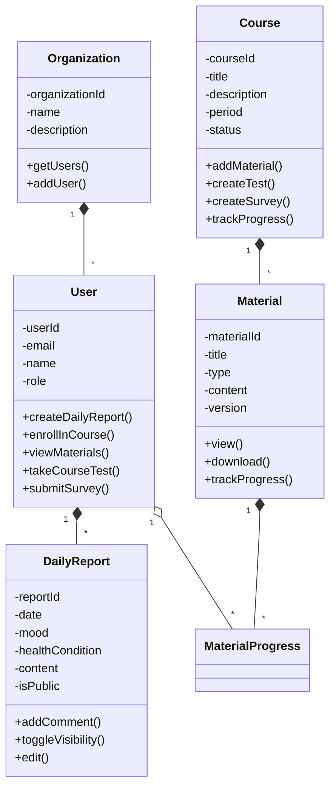
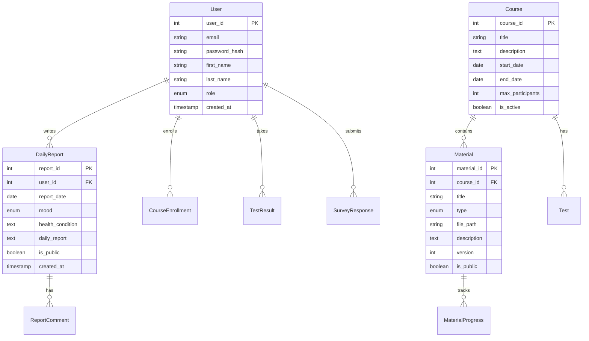
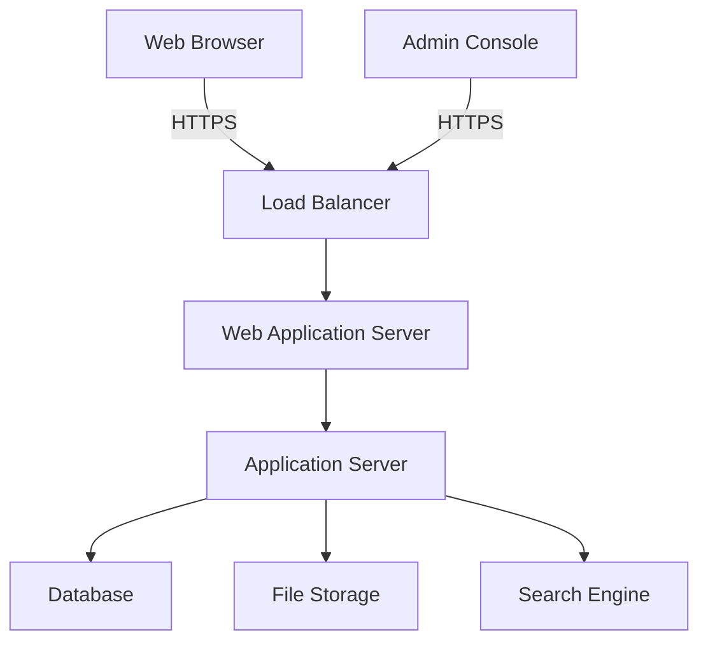

# 学習管理システム（LMS）設計仕様書

## 目次
1. [要件定義](#1-要件定義)
2. [ドメインモデル](#2-ドメインモデル)
3. [データモデル](#3-データモデル)

# 1. 要件定義

## 1.1 システム概要
本システムは、組織における効果的な学習管理を実現するためのLMS（Learning Management System）である。オンライン学習環境を提供し、学習者の進捗管理、教材の配信、成績評価などを一元管理するプラットフォームとして機能する。

## 1.2 機能要件

### 1.2.1 ユーザー管理機能
- システム管理者による一括登録機能
- ユーザーの役割設定（学習者、講師、管理者）
- ユーザープロファイルの管理
- パスワードリセット機能
- セキュアなログイン機能
- シングルサインオン（SSO）対応
- 役割ベースのアクセス制御

### 1.2.2 日報・体調管理機能
- 日次の日報登録機能
- 気分や体調をニコニコカレンダーで登録
- 日報の公開範囲設定（他の参加者への公開/非公開）
- 講師・企業担当者による日報確認・返信機能
- 日報検索・フィルタリング機能
- 体調履歴の表示・分析
- 体調報告に基づくアラート機能

### 1.2.3 研修資料・教材管理
- 研修資料のアップロード・配布機能
- アプリケーション内での資料閲覧機能
- 資料のダウンロードリンク提供
- Eラーニング動画の配信・視聴機能
- 教材の閲覧状況トラッキング
- 管理者向け閲覧状況レポート機能
- 研修資料の版管理
- 教材の検索機能

### 1.2.4 評価・アンケート機能
- 研修ごとの理解度確認テスト作成・実施
- テスト結果の自動採点
- 受講者へのフィードバック機能
- テスト結果の分析・レポート
- アンケート作成・実施
- アンケート結果の集計・分析
- カスタマイズ可能なアンケートテンプレート

### 1.2.5 研修セット管理機能
- 参加者ごとの研修セット登録
- 研修セットの進捗管理
- 総合レポート生成（理解度確認テスト・アンケート結果を含む）
- 研修セット完了状況の管理

## 1.3 非機能要件

### 1.3.1 性能要件
- 同時接続ユーザー数：1,000人以上
- 画面応答時間：3秒以内
- ファイルアップロード上限：1GB
- システム稼働時間：24時間365日

### 1.3.2 セキュリティ要件
- データの暗号化（通信時・保存時）
- アクセスログの取得・保管
- 定期的なバックアップ
- 脆弱性診断の実施

### 1.3.3 可用性要件
- システム可用性：99.9%以上
- 障害時の復旧時間：4時間以内
- データバックアップ：日次実施
- 災害対策（DR）サイトの設置

# 2. ドメインモデル

## 2.1 主要ドメイン

## 2.2 ドメイン間の関係性

### 2.2.1 組織とユーザーの関係
- 組織は複数のユーザーを持つ
- ユーザーは必ず1つの組織に所属
- 組織単位での権限管理

### 2.2.2 ユーザーと各機能の関係
- ユーザーは日報を作成・管理
- コースへの登録と進捗管理
- テストの受験とアンケートへの回答

### 2.2.3 研修セットとコースの関係
- 研修セットは複数のコースを含む
- コースは教材、テスト、アンケートを管理
- 進捗は個人単位で追跡

## 2.3 ビジネスルール

### 2.3.1 日報管理ルール
- 日報は1日1件のみ作成可能
- 公開範囲の設定は後から変更可能
- コメントは関係者のみ可能

### 2.3.2 研修管理ルール
- コースは研修セットに属さなくても存在可能
- 教材の更新は版管理で追跡
- 進捗は自動で計算・更新

# 3. データモデル

## 3.1 ER図

## 3.2 主要テーブル定義

### User（ユーザー）
| カラム名 | データ型 | 説明 | 制約 |
|----------|----------|------|------|
| user_id | INTEGER | ユーザーID | PRIMARY KEY |
| email | VARCHAR(255) | メールアドレス | UNIQUE, NOT NULL |
| password_hash | VARCHAR(255) | パスワードハッシュ | NOT NULL |
| first_name | VARCHAR(50) | 名 | NOT NULL |
| last_name | VARCHAR(50) | 姓 | NOT NULL |
| role | ENUM | 役割 | NOT NULL |
| created_at | TIMESTAMP | 作成日時 | NOT NULL |

### DailyReport（日報）
| カラム名 | データ型 | 説明 | 制約 |
|----------|----------|------|------|
| report_id | INTEGER | 日報ID | PRIMARY KEY |
| user_id | INTEGER | ユーザーID | FOREIGN KEY |
| report_date | DATE | 報告日 | NOT NULL |
| mood | ENUM | 気分（5段階） | NOT NULL |
| health_condition | TEXT | 体調状態 | - |
| daily_report | TEXT | 日報内容 | NOT NULL |
| is_public | BOOLEAN | 公開設定 | NOT NULL |

### Course（コース）
| カラム名 | データ型 | 説明 | 制約 |
|----------|----------|------|------|
| course_id | INTEGER | コースID | PRIMARY KEY |
| title | VARCHAR(255) | コースタイトル | NOT NULL |
| description | TEXT | コース説明 | - |
| start_date | DATE | 開始日 | NOT NULL |
| end_date | DATE | 終了日 | NOT NULL |
| max_participants | INTEGER | 最大参加者数 | - |
| is_active | BOOLEAN | アクティブ状態 | NOT NULL |

# 4. システム構成図

# 5. セキュリティ設計

## 5.1 認証・認可
- JWTによるトークンベース認証
- Role-based Access Control (RBAC)
- セッション管理
- パスワードハッシュ化（bcrypt）

## 5.2 データ保護
- TLS 1.3による通信の暗号化
- データベース暗号化
- ファイルストレージ暗号化
- 個人情報の匿名化

## 5.3 監査
- アクセスログの記録
- 操作ログの記録
- 定期的なセキュリティ監査
- インシデント対応計画

# 6. 運用設計

## 6.1 バックアップ
- データベース：日次フルバックアップ
- ファイル：差分バックアップ
- ログ：リアルタイムレプリケーション
- バックアップ保持期間：7年

## 6.2 監視
- サーバーリソース監視
- アプリケーション性能監視
- ログ監視
- アラート設定

## 6.3 保守
- 定期メンテナンス計画
- パッチ適用手順
- バージョンアップ計画
- 障害復旧手順